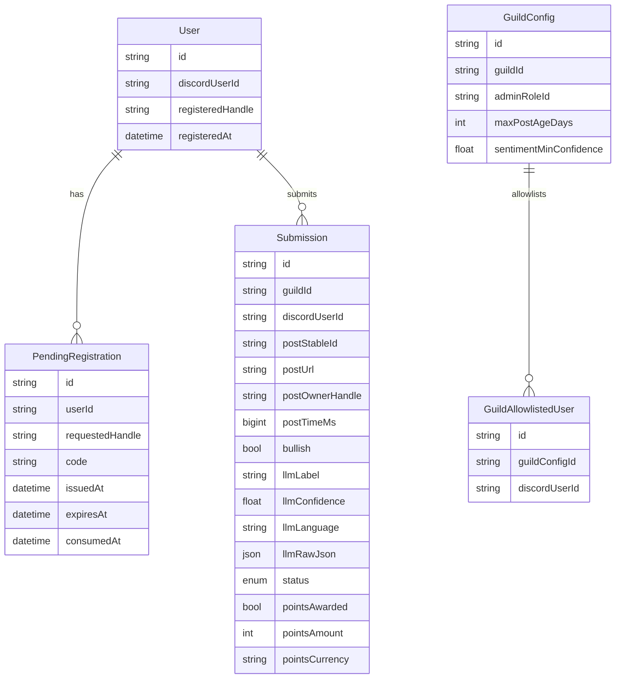

### Database

The bot uses Postgres (via Prisma) as the source of truth for:
- global user registrations (Discord ↔ CMC handle)
- pending registration proofs (codes)
- guild configuration (admin role/allowlist, thresholds)
- submissions, decisions, and points-award tracking

Schema source: `prisma/schema.prisma`

### Entity overview



### Invariants / constraints

- **Global registration**:
  - `User.discordUserId` is unique
  - a Discord user can have at most one `registeredHandle`
- **Registration code uniqueness**:
  - `PendingRegistration.code` is unique
  - codes are time-limited (12h) and single-use (`consumedAt`)
- **Submission de-dupe**:
  - `Submission.postStableId` is unique → a post can be submitted only once globally

### Migrations

Migrations live in `prisma/migrations/` and are applied with:

```bash
docker compose exec bot npx prisma migrate deploy
```

### Data retention (recommendations)

For public OSS deployments, consider adding:
- a retention job to delete old `PendingRegistration` rows
- an option to redact stored `postText` after decision/award is finalized

